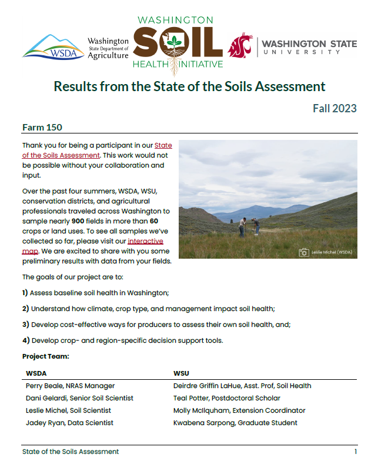
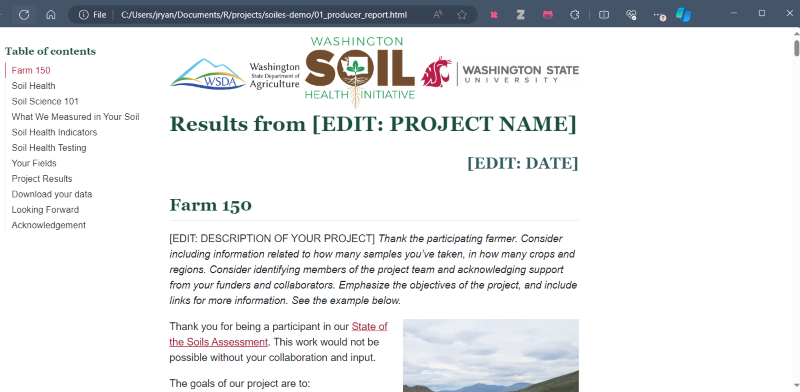

# soils <a href="https://wa-department-of-agriculture.github.io/soils/">{align="right" height="138"}</a>

<!-- badges: start -->

[](https://www.repostatus.org/#wip)

[](https://CRAN.R-project.org/package=soils) [](https://wa-department-of-agriculture.r-universe.dev/) [](https://wa-department-of-agriculture.r-universe.dev/soils) [](https://github.com/WA-Department-of-Agriculture/soils/actions/workflows/R-CMD-check.yaml)

<!-- badges: end -->

```{r setup, include=FALSE}
knitr::opts_chunk$set(
  fig.align = "left",
  dpi = 300
)
```

## Overview

As part of the [Washington Soil Health Initiative](https://washingtonsoilhealthinitiative.com/), the [Washington State Department of Agriculture](https://agr.wa.gov/departments/land-and-water/natural-resources/soil-health) and [Washington State University](https://soilhealth.wsu.edu/) developed {soils} for soil health data visualization and reporting.

{soils} gives you a RStudio project template with everything you need to generate custom HTML and Microsoft Word reports for each participant in your soil health survey.

## Quick Video Demos

### Create a {soils} Project

[create_soils.webm](https://github.com/WA-Department-of-Agriculture/soils/assets/95007373/7e8c650c-362c-4f81-9e24-3fb4b21f9d35)

### Render a MS Word Report

[create_docx.webm](https://github.com/WA-Department-of-Agriculture/soils/assets/95007373/b769f797-a390-4834-ac40-ab65cea7ef5f)

### Render a HTML Report

[create_html.webm](https://github.com/WA-Department-of-Agriculture/soils/assets/95007373/13d33152-b509-4651-a48d-e490be3c9464)

### Programmatically Render Multiple Reports at Once

[render_reports.webm](https://github.com/WA-Department-of-Agriculture/soils/assets/95007373/fdb93fed-6c83-40fa-beac-1f3e352ce472)

## Requirements

The report template uses [Quarto](https://quarto.org/docs/get-started/), which is the next-generation version of [R Markdown](https://quarto.org/docs/faq/rmarkdown.html).

We assume you're working in RStudio Desktop with a version of at least [v2022.07](https://dailies.rstudio.com/version/2022.07.2+576.pro12/) for editing and previewing Quarto documents. Though it is strongly recommended that you use the [latest release](https://posit.co/download/rstudio-desktop/) of RStudio.

To render `.docx` files, you must have Microsoft Word installed.

## Installation

Install the development version of {soils} from our [r-universe](https://wa-department-of-agriculture.r-universe.dev/) with:

```{r install-r-universe, eval=FALSE}
install.packages(
  "soils",
  repos = c(
    "https://wa-department-of-agriculture.r-universe.dev",
    "https://cloud.r-project.org",
    "https://ftp.osuosl.org/pub/cran/"
  )
)
```

```{r load-soils, eval=FALSE}
# Load all the example data sets and functions
library(soils)
```

## Creating a New {soils} Project

Use the RStudio IDE to create a new {soils} RStudio project.

`Open RStudio` \> `File` \> `New Project` \> `New Directory` \> **`Quarto Soil Health Report`**

{fig-alt="Screenshot of RStudio New Project Wizard with Quarto Soil Health Report selected."}

Enter your desired directory name, browse to where you want the project to live, and check whether you want the project to open in a new RStudio session.

{fig-alt="Screenshot of RStudio New Project Wizard for Quarto Soil Health Report. Enter directory name, path, and check whether you want the project to open in a new RStudio session."}

A new RStudio project will open with the template Quarto report and a script to render all reports. Other documents and resources will appear in the files pane.

{fig-alt="Screenshot of new RStudio project called demo-soils. A Quarto file called producer_report.qmd is open and there is a tab for an R script called render_reports.R that renders all reports at once. The files pane is open with a project directory full of other Quarto files, styling resources, example images and data."}

**Read the article [Get Started](https://wa-department-of-agriculture.github.io/soils/articles/get-started.html) to learn what goodies are bundled within {soils}.**

## Example Soil Health Reports

{soils} helps you generate custom static `.docx` reports and interactive `.html` reports for every producer or land owner in your soil health survey project.

See demo reports rendered directly from this template project:

### [MS Word Example](https://wa-department-of-agriculture.github.io/soils/articles/docx.html)

[{fig-alt="Screenshot of example .docx report" height="500px"}](https://wa-department-of-agriculture.github.io/soils/articles/docx.html)

### [HTML Example](https://wa-department-of-agriculture.github.io/soils/articles/html.html)

[{fig-alt="Screenshot of .html report"}](https://wa-department-of-agriculture.github.io/soils/articles/html.html)

**Read the article [Build a Report](https://wa-department-of-agriculture.github.io/soils/articles/build-report.html) for a detailed walk-through of the project and workflow for adapting this template for your own project.**

## Acknowledgement and Citation

The below acknowledgement is automatically embedded in each report:

```{r acknowledgement, echo = FALSE, results='asis'}
acknowledgement <- knitr::knit_child(
  here::here("inst/template/09_acknowledgement.qmd"),
  quiet = TRUE
)

cat(">", acknowledgement)
```

```{r citation-header, results='asis'}
citation <- citation("soils")

header <- format(citation, style = "citation")[[1]]
text <- format(citation, style = "textVersion")

cat(header)
```

```{r citation-text, results='asis'}
cat(">", text)
```

## Credits

{soils} adapts from existing R project templating resources and packages:

-   [RStudio Project Templates](https://rstudio.github.io/rstudio-extensions/rstudio_project_templates.html)
-   [{ratlas}](https://github.com/atlas-aai/ratlas)
-   [{quartotemplate}](https://github.com/Pecners/quartotemplate)
-   [{golem}](https://github.com/ThinkR-open/golem/)
