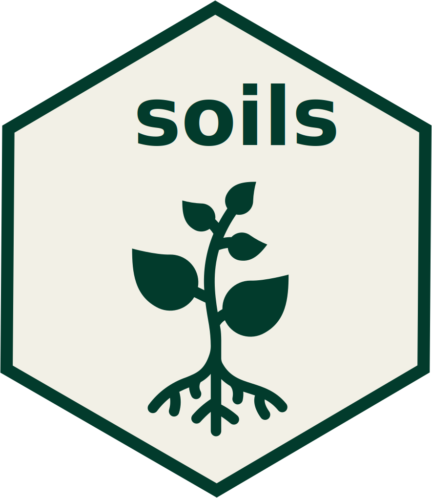

# soils <a href="https://wa-department-of-agriculture.github.io/soils/">{align="right" height="138"}</a>

<!-- badges: start -->

<!-- badges: end -->

## Overview

As part of the [Washington Soil Health Initiative](https://washingtonsoilhealthinitiative.com/), [Washington State Department of Agriculture](https://agr.wa.gov/departments/land-and-water/natural-resources/soil-health) and [Washington State University](https://soilhealth.wsu.edu/) developed `soils` for soil health data visualization and reporting.

Inspired by the [`ratlas`](https://github.com/atlas-aai/ratlas) package and Spencer Schien's [blog post](https://spencerschien.info/post/r_for_nonprofits/quarto_template/) on including a Quarto template within an R package, `soils` is intended to help you generate reports for each producer or land owner that participates in your soil sampling project.

## Disclaimer

This repository and package are a **work in progress**.

## Installation

Install the development version of `soils` from [GitHub](https://github.com/) with:

```{r install-github, eval=FALSE}
# install.packages("devtools")
devtools::install_github("WA-Department-of-Agriculture/soils")
```

## Requirements

The report template uses [Quarto](https://quarto.org/docs/get-started/), which is the next-generation version of R Markdown. Your version of RStudio must be at least v2022.07 for editing and previewing Quarto documents. Though it is strongly recommended that you use the [latest release](https://posit.co/download/rstudio-desktop/) of RStudio.

To render `.docx` files, you must have Microsoft Word installed.

## Creating a New `soils` Project

Read the [New Template Project Article](https://wa-department-of-agriculture.github.io/soils/articles/project.html) for a detailed how-to.

To view the vignette within RStudio, run the command `vignette("project", "soils")`.

## Soil Health Reports

This package can generate static `.docx` reports and interactive `.html` reports.

Read the article on [Soil Health Reports](https://wa-department-of-agriculture.github.io/soils/articles/report.html) for a detailed how-to and to check out the example reports.

To view the vignette within RStudio, run the command `vignette("report", "soils")`.

{fig-alt="First page of example .docx report"}

{fig-alt="Screenshot of .html report"}

## R Scripts and Visualization Functions

Read the [Visualization Functions Article](https://wa-department-of-agriculture.github.io/soils/articles/functions.html) for more details.

To view the vignette within RStudio, run the command `vignette("functions", "soils")`.

## `washi` Theme

Default fonts and colors within `soils` come from the Washington Soil Health Initiative (WaSHI) branding package [`washi`](https://wa-department-of-agriculture.github.io/washi/). This allows you to create beautiful plots, tables, and reports out of the box. You can customize the fonts and colors to match your own branding by modifying the `soils` functions, style sheets, and report templates.

To install, import, and register the default fonts ([Lato](https://fonts.google.com/specimen/Lato?query=lato) for headings, [Poppins](https://fonts.google.com/specimen/Poppins?query=poppins) for body text), follow these [instructions](https://wa-department-of-agriculture.github.io/washi/#requirements.)

## Acknowledgement and Citation

The below acknowledgement and citation are automatically embedded in each report.

```{r, echo = FALSE, results='asis'}
acknowledgement <- knitr::knit_child(
  "./inst/template/inst/07_acknowledgement.qmd", 
  quiet = TRUE)

cat(acknowledgement, sep = "\n")
```
