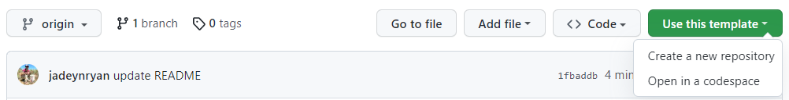

<!-- README.md is generated from README.Rmd. Please edit that file -->

# soils

<!-- badges: start -->
<!-- badges: end -->

## Disclaimer

This repository and package are a **work in progress**.

## Instructions

The report template uses
[Quarto](https://quarto.org/docs/get-started/hello/rstudio.html), which
is the next-generation version of R Markdown. Your version of RStudio
must be at least v2022.07 for editing and previewing Quarto documents.

1.  Open RStudio \> File \> New Project \> Version Control \> Git \>
    paste this URL
    <https://github.com/WA-Department-of-Agriculture/soils.git> to clone
    the repo and get all the files needed to render the report

    - Or, click the green “Use this template” button to “Create a new
      repository”

2.  Run renv::restore() in your console to install the packages into
    this project

3.  Go to the data folder \> open example_data.csv and
    data_dictionary.csv

    - Format your own dataset to match the structure of the example
      template (metadata column names must match exactly)
    - Edit the data_dictionary.csv to match your measurement column
      names

4.  Open producer_report.qmd in the inst folder.

    - Edit title, subtitle, params in the top yaml

    - Edit the chunk called ‘load-data’ to read in your own dataset

    - Click the Render button

5.  Iterate over step 4 by changing the params to each producerId you
    want to generate a report for. The render.R file that will render
    reports for all producers in your dataset hasn’t been updated to
    work yet.
