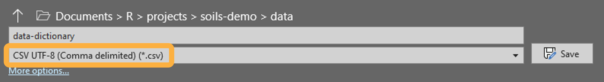

# Import your data

You can immediately install {soils}, create a new template project, and
render example reports, as demonstrated in the last two tutorials.
However, you will need to customize and edit the content to fit your
project, shown in the next three tutorials: [**Customize &
write**](https://wa-department-of-agriculture.github.io/soils/articles/customize.html),
[**Render
reports**](https://wa-department-of-agriculture.github.io/soils/articles/render.html),
and
[**Troubleshoot**](https://wa-department-of-agriculture.github.io/soils/articles/troubleshoot.html).

## Access the example datasets

An example dataset and data dictionary are included in every {soils}
project. Access the `.csv` files in the `data` folder, or load the
package and call the dataframes by name as shown below.

Load {soils} and see first five rows of each dataframe

``` r
library(soils)
head(washi_data, 5) |> knitr::kable()
```

| year | sample_id   | farm_name | producer_id | field_name | field_id | county    | crop            | longitude | latitude | texture    | bd_g_cm3 | pmn_lb_ac | nh4_n_mg_kg | no3_n_mg_kg | poxc_mg_kg |  ph | ec_mmhos_cm | k_mg_kg | ca_mg_kg | mg_mg_kg | na_mg_kg | cec_meq_100g | b_mg_kg | cu_mg_kg | fe_mg_kg | mn_mg_kg | s_mg_kg | zn_mg_kg | total_c_percent | total_n_percent | ace_g_protein_kg_soil | sand_percent | silt_percent | clay_percent | min_c_96hr_mg_c_kg_day | p_olsen_mg_kg | wsa_percent | om_percent | toc_percent | whc_in_ft | inorganic_c_percent |
|-----:|:------------|:----------|:------------|:-----------|---------:|:----------|:----------------|----------:|---------:|:-----------|---------:|----------:|------------:|------------:|-----------:|----:|------------:|--------:|---------:|---------:|---------:|-------------:|--------:|---------:|---------:|---------:|--------:|---------:|----------------:|----------------:|----------------------:|-------------:|-------------:|-------------:|-----------------------:|--------------:|------------:|-----------:|------------:|----------:|--------------------:|
| 2023 | 23-WUY05-01 | Farm 150  | WUY05       | Field 01   |        1 | County 9  | Hay/Silage      |      -119 |       49 | Clay Loam  |     1.30 |     67.13 |         1.6 |         9.2 |        496 | 6.7 |        0.42 |     498 |     1380 |    145.2 |     16.1 |          7.8 |    0.22 |      0.6 |       26 |      1.5 |    4.29 |      1.7 |            1.85 |            0.16 |                  6.74 |           44 |           23 |           33 |                   35.6 |            15 |        88.5 |        4.5 |        1.85 |      1.01 |                  NA |
| 2022 | 22-RHM05-02 | Farm 085  | RHM05       | Field 02   |        2 | County 18 | Green Manure    |      -123 |       47 | Sandy Loam |     0.88 |    129.97 |        21.6 |         6.1 |        571 | 5.9 |        0.05 |     198 |      780 |     96.8 |     20.7 |         10.5 |    0.09 |      0.4 |       28 |      2.7 |    9.41 |      0.8 |            2.88 |            0.18 |                 21.50 |           69 |           21 |           10 |                   30.0 |            37 |        92.6 |        5.8 |        2.88 |      1.08 |                  NA |
| 2022 | 22-ENR07-02 | Farm 058  | ENR07       | Field 02   |        2 | County 11 | Vegetable       |      -122 |       47 | Silt Loam  |     1.21 |    122.17 |         8.1 |        25.3 |        419 | 6.3 |        0.60 |     294 |     1760 |    266.2 |     20.7 |         13.0 |    0.41 |      4.2 |      141 |      4.1 |   26.73 |      4.2 |            1.68 |            0.14 |                 10.90 |           11 |           79 |           10 |                   15.0 |            73 |        91.3 |        2.4 |        1.68 |      2.77 |                  NA |
| 2022 | 22-ZTD04-03 | Farm 061  | ZTD04       | Field 03   |        3 | County 13 | Herb            |      -120 |       46 | Silt Loam  |     1.37 |     95.24 |        13.8 |        16.9 |        424 | 6.8 |        2.18 |     229 |     3380 |    738.1 |     80.5 |         14.4 |    0.72 |      1.1 |       37 |     11.5 |   51.70 |      2.4 |            1.40 |            0.12 |                  5.53 |           36 |           51 |           13 |                   67.5 |            30 |        94.3 |        2.9 |        1.40 |      1.93 |                  NA |
| 2023 | 23-WUY05-03 | Farm 150  | WUY05       | Field 03   |        3 | County 9  | Pasture, Seeded |      -119 |       49 | Sandy Loam |     1.22 |    111.35 |         3.9 |         6.7 |        547 | 7.6 |        0.60 |     273 |     2820 |    193.6 |     13.8 |         10.1 |    0.25 |      0.7 |       15 |      1.7 |    3.29 |      0.8 |            1.65 |            0.16 |                  4.20 |           64 |           33 |            3 |                   50.6 |             8 |        84.6 |        6.7 |        1.53 |      1.28 |                0.12 |

``` r
head(data_dictionary, 5) |> knitr::kable()
```

| measurement_group | column_name  | abbr         | unit  |
|:------------------|:-------------|:-------------|:------|
| Physical          | texture      | Texture      |       |
| Physical          | sand_percent | Sand         | %     |
| Physical          | silt_percent | Silt         | %     |
| Physical          | clay_percent | Clay         | %     |
| Physical          | bd_g_cm3     | Bulk Density | g/cm³ |

Use `washi_data` and `data_dictionary` as templates when formatting your
own data to use in {soils} functions and reports.

## Data template

Your data must contain the below required columns and each soil
measurement must be in its own column, as shown in `washi_data`.

Glimpse at the example data

``` r
dplyr::glimpse(washi_data)
#> Rows: 100
#> Columns: 42
#> $ year                   <int> 2023, 2022, 2022, 2022, 2023, 2022, 2023, 2022,…
#> $ sample_id              <chr> "23-WUY05-01", "22-RHM05-02", "22-ENR07-02", "2…
#> $ farm_name              <chr> "Farm 150", "Farm 085", "Farm 058", "Farm 061",…
#> $ producer_id            <chr> "WUY05", "RHM05", "ENR07", "ZTD04", "WUY05", "B…
#> $ field_name             <chr> "Field 01", "Field 02", "Field 02", "Field 03",…
#> $ field_id               <int> 1, 2, 2, 3, 3, 2, 1, 2, 1, 1, 1, 1, 2, 8, 2, 1,…
#> $ county                 <chr> "County 9", "County 18", "County 11", "County 1…
#> $ crop                   <chr> "Hay/Silage", "Green Manure", "Vegetable", "Her…
#> $ longitude              <int> -119, -123, -122, -120, -119, -117, -118, -117,…
#> $ latitude               <int> 49, 47, 47, 46, 49, 47, 49, 47, 48, 48, 46, 47,…
#> $ texture                <chr> "Clay Loam", "Sandy Loam", "Silt Loam", "Silt L…
#> $ bd_g_cm3               <dbl> 1.30, 0.88, 1.21, 1.37, 1.22, 1.14, 1.44, 1.24,…
#> $ pmn_lb_ac              <dbl> 67.13, 129.97, 122.17, 95.24, 111.35, 61.92, -7…
#> $ nh4_n_mg_kg            <dbl> 1.6, 21.6, 8.1, 13.8, 3.9, 12.4, 2.4, 12.4, 2.3…
#> $ no3_n_mg_kg            <dbl> 9.2, 6.1, 25.3, 16.9, 6.7, 4.3, 21.5, 7.4, 2.3,…
#> $ poxc_mg_kg             <int> 496, 571, 419, 424, 547, 235, 501, 480, 965, 10…
#> $ ph                     <dbl> 6.7, 5.9, 6.3, 6.8, 7.6, 5.5, 5.5, 5.9, 6.3, 6.…
#> $ ec_mmhos_cm            <dbl> 0.42, 0.05, 0.60, 2.18, 0.60, 0.81, 0.55, 0.34,…
#> $ k_mg_kg                <int> 498, 198, 294, 229, 273, 372, 289, 355, 253, 73…
#> $ ca_mg_kg               <int> 1380, 780, 1760, 3380, 2820, 1480, 1140, 2080, …
#> $ mg_mg_kg               <dbl> 145.2, 96.8, 266.2, 738.1, 193.6, 229.9, 133.1,…
#> $ na_mg_kg               <dbl> 16.1, 20.7, 20.7, 80.5, 13.8, 16.1, 23.0, 16.1,…
#> $ cec_meq_100g           <dbl> 7.8, 10.5, 13.0, 14.4, 10.1, 12.4, 12.9, 14.8, …
#> $ b_mg_kg                <dbl> 0.22, 0.09, 0.41, 0.72, 0.25, 0.18, 0.12, 0.21,…
#> $ cu_mg_kg               <dbl> 0.6, 0.4, 4.2, 1.1, 0.7, 1.0, 0.5, 1.4, 1.1, 0.…
#> $ fe_mg_kg               <int> 26, 28, 141, 37, 15, 64, 44, 85, 129, 31, 86, 3…
#> $ mn_mg_kg               <dbl> 1.5, 2.7, 4.1, 11.5, 1.7, 9.0, 4.4, 17.1, 9.9, …
#> $ s_mg_kg                <dbl> 4.29, 9.41, 26.73, 51.70, 3.29, 4.51, 9.13, 8.2…
#> $ zn_mg_kg               <dbl> 1.7, 0.8, 4.2, 2.4, 0.8, 0.5, 34.0, 0.9, 7.8, 0…
#> $ total_c_percent        <dbl> 1.85, 2.88, 1.68, 1.40, 1.65, 1.55, 2.25, 2.37,…
#> $ total_n_percent        <dbl> 0.16, 0.18, 0.14, 0.12, 0.16, 0.13, 0.15, 0.17,…
#> $ ace_g_protein_kg_soil  <dbl> 6.74, 21.50, 10.90, 5.53, 4.20, 10.30, 7.73, 6.…
#> $ sand_percent           <int> 44, 69, 11, 36, 64, 24, 80, 22, 62, 48, 80, 69,…
#> $ silt_percent           <int> 23, 21, 79, 51, 33, 62, 16, 57, 26, 45, 14, 27,…
#> $ clay_percent           <int> 33, 10, 10, 13, 3, 14, 4, 21, 12, 7, 6, 4, 10, …
#> $ min_c_96hr_mg_c_kg_day <dbl> 35.60, 30.00, 15.00, 67.50, 50.60, 25.50, 30.60…
#> $ p_olsen_mg_kg          <int> 15, 37, 73, 30, 8, 33, 27, 29, 40, 16, 19, 11, …
#> $ wsa_percent            <dbl> 88.5, 92.6, 91.3, 94.3, 84.6, 86.6, 86.9, 82.5,…
#> $ om_percent             <dbl> 4.5, 5.8, 2.4, 2.9, 6.7, 3.2, 27.0, 4.2, 7.9, 5…
#> $ toc_percent            <dbl> 1.85, 2.88, 1.68, 1.40, 1.53, 1.55, 2.25, 2.37,…
#> $ whc_in_ft              <dbl> 1.01, 1.08, 2.77, 1.93, 1.28, 2.25, 0.84, 2.14,…
#> $ inorganic_c_percent    <dbl> NA, NA, NA, NA, 0.12, NA, NA, NA, NA, NA, NA, N…
```

Your data **must have the below required columns**. However, only the
columns in **bold** are required to have values. Put another way, your
data must have these column names, even if every row is blank.
Otherwise, the `data-validation` chunk in `01_producer-report.qmd` or
{soils} functions will error. For more details, see [Data/dictionary
mismatches](#datadictionary-mismatches).

- **`year <int>`** is used to select samples to be included in the
  report.

- **`sample_id <chr>`** must be unique throughout the dataset.

- `farm_name <chr>` is included at the top of the report. If blank, it
  is replaced with “Farm: `producer_id`”.

- **`producer_id <chr>`** is used to select samples to be included in
  the report.

- **`field_id <chr>`** must be unique across all fields for each
  producer and is displayed in tables and tool tips for maps.

- `county <chr>` is used to group and summarize samples from the same
  county as the producer. Can be blank.

- `crop <chr>` is used to group and summarize samples from the same crop
  as the producer. Can be blank.

- `longitude <int>` and `latitude <int>` are used to map each sample
  point using. If blank, the map will not be included.

- `texture <chr>` is used in the “physical” measurement group table.
  This column is not used in the texture triangle plot, which is instead
  created from percentage sand, silt, and clay measurement results. If
  at least two of `sand_percent`, `silt_percent`, and `clay_percent` are
  provided, `texture` will be classified according to the USDA NRCS
  textural classification. See
  [`classify_texture()`](https://wa-department-of-agriculture.github.io/soils/dev/reference/classify_texture.md)
  for more information.

- **Each soil measurement** must have its own column in the dataset and
  a corresponding row in the data dictionary, as shown in [Dictionary
  template](#dictionary-template).

  - Measurement columns come **after** the required columns for easy
    selection in the [`tidy-long` chunk](#tidy-long-chunk).

## Dictionary template

The data dictionary is used to group and order soil measurements, and to
nicely format labels in tables and plots. The example `data_dictionary`
contains [UTF-8](https://www.unicode.org/faq/utf_bom.html) encoded
superscripts, subscripts, and special characters.

To properly encode your data dictionary as UTF-8, save it to the `data`
folder as `CSV UTF-8 (Comma delimited) (*.csv)` in MS Excel.



Glimpse at the example data dictionary

``` r
dplyr::glimpse(data_dictionary)
#> Rows: 32
#> Columns: 4
#> $ measurement_group <chr> "Physical", "Physical", "Physical", "Physical", "Phy…
#> $ column_name       <chr> "texture", "sand_percent", "silt_percent", "clay_per…
#> $ abbr              <chr> "Texture", "Sand", "Silt", "Clay", "Bulk Density", "…
#> $ unit              <chr> "", "%", "%", "%", "g/cm³", "%", "in/ft", "%", "mg/k…
```

Your data dictionary **must have the below required columns** for every
soil measurement included in your data.

- **`measurement_group <chr>`** determines how the soil measurements are
  grouped. The order in which these groups appear in the report is
  determined by the order they are listed within the data dictionary.

- **`column_name <chr>`** is used to join the dictionary with your data.
  Must exactly match the column names of the soil measurements in your
  dataset. The order in which these measurements appear within their
  `measurement_group` is determined by the order they are listed within
  the data dictionary.

- **`abbr <chr>`** and **`unit <chr>`** are how soil measurements are
  labeled in tables with the abbreviation as the column header and unit
  as a secondary spanning header.

## Data/dictionary mismatches

Getting your data and dictionary in the proper format to render the
report without errors will likely be the most difficult part of making
{soils} work for your project.

The [`data-validation` chunk](#data-validation-chunk) and many {soils}
functions include
[`testthat::expect_contains()`](https://testthat.r-lib.org/reference/expect_setequal.html)
to fail early if required columns are missing from either the data or
the dictionary. This early failure saves time by stopping as soon as the
missing column or data/dictionary mismatch is identified. Additionally,
these early failed tests provide the `expected` versus `actual` values,
making it easier to correct the issue with minimal debugging.

Below are some common issues that arise and possible workarounds. These
workarounds may make more sense after reviewing the [Your
data](#your-data) section that includes example errors and fixes.

### Extra columns in data

**Soil measurements in your data but not in your dictionary** will cause
the report to error in the `data-validation` chunk. For example,
rendering the report will fail if your dataset contains both `pH` and
`CEC` results but your dictionary only contains `pH`. Either add the
`CEC` measurement to your dictionary or remove this measurement column
from your data. If you don’t want to delete the column from your
datasheet, you can remove it from only the data object with
`data <- dplyr::select(data, -cec_meq_100g)` perhaps in the `load-data`
chunk.

**Additional metadata columns in your data** will also cause the report
to error in the `data-validation` chunk. For example, if you have a
column `phone_number` with producer phone numbers that won’t be used in
the report, remove it from the data with the
`data <- dplyr::select(data, -c(cec_meq_100g, phone_number))`. If you
want to use this column in the report, then add it to the
`required_cols` vector of the [`data-validation`
chunk](#data-validation-chunk) so that the `testthat` function doesn’t
error.

### Extra rows in dictionary

**Soil measurements in your dictionary but not in your data** will not
error and will not affect the report. For example, the report will
simply show the `pH` results if your dictionary contains both `pH` and
`CEC` but your data only contains `pH` results.

## Your data

Once your project data and dictionary files match the structure of the
examples and are saved in the `data` folder, follow along with the
changes in the code chunks in `01_producer-report.qmd`. Code you will
need to change are marked with the text “`EDIT:`”. Find all edit markers
in the RStudio project with `Ctrl` + `Shift` + `F` to open the
`Find in Files` wizard.

Below changes are for demonstration purposes only, the actual changes
should be based on **your** data and dictionary.

### `load-data` chunk

Replace `washi-data.csv` with the name of your data file
(`my-data.csv`).

Example changed chunk

``` r
# EDIT: Add your cleaned lab data to the data folder, using 'washi-data.csv' as
# a template.

# Load lab results
data <- read.csv(
  here::here("data/my-data.csv"),
  check.names = FALSE,
  encoding = "UTF-8",
  strip.white = TRUE
)
```

### `load-dictionary` chunk

Change `data-dictionary.csv` to the name of your dictionary file
(`my-dictionary.csv`). If using subscripts, superscripts, or special
characters, make sure your csv is saved with UTF-8 encoding (see
[Dictionary template](#dictionary-template) for how to do this).

Example changed chunk

``` r
# EDIT: Add your data dictionary to the data folder, using 'data-dictionary.csv'
# as a template.

# Load data dictionary
dictionary <- read.csv(
  here::here("data/my-dictionary.csv"),
  check.names = FALSE,
  # Set encoding for using subscripts, superscripts, special characters
  encoding = "UTF-8",
  strip.white = TRUE
)
```

### `tidy-long` chunk

Ensure the column ranges in
[`dplyr::across()`](https://dplyr.tidyverse.org/reference/across.html)
and
[`tidyr::pivot_longer()`](https://tidyr.tidyverse.org/reference/pivot_longer.html)
match the column range of your soil measurements. In the example
`washi-data.csv`, this range is `11:41`. This chunk [tidies the
data](https://vita.had.co.nz/papers/tidy-data.pdf) from wide to long for
summarization and visualization.

In this example, imagine you have one additional metadata column before
your measurement columns begin. This means your column range of soil
measurements is `12:42`.

Example changed chunk

``` r
# Get index last column of data frame
num_cols <- ncol(data)

# Tidy data into long format and join with data dictionary
results_long <- data |>
  dplyr::mutate(
    # EDIT: make sure this matches the column range of your soil measurements
    dplyr::across(
      12:dplyr::all_of(num_cols),
      as.numeric
    )
  ) |>
  tidyr::pivot_longer(
    # EDIT: make sure this matches the column range of your soil measurements
    cols = 12:dplyr::all_of(num_cols),
    names_to = "measurement"
  ) |>
  ...
```

### `data-validation` chunk

This chunk checks there are no mismatches as described in
[Data/dictionary mismatches](#datadictionary-mismatches) by making sure
all column names in your dataset are in either the `required_cols`
vector or the `column_name` column of `my-dictionary.csv`.

In this example, add an extra column named `tillage` in `my-data.csv`
without changing the dictionary.

After clicking the `Render` button, the report failed.

``` r
Quitting from lines 94-115 [data-validation] (01_producer-report.qmd)
Error:
! names(data) (`actual`) isn't fully contained within c(required_cols, dictionary$column_name) (`expected`).
* Missing from `expected`: "tillage"
* Present in `expected`:   "year", "sample_id", "farm_name", "producer_id", "field_id", "county", "crop", "longitude", ...
```

This error message says the error occurred in lines 94-115 in the
`data-validation` chunk because `tillage` was missing from the
`expected` values, which are elements of `required_cols` and
`dictionary$column_name`.

Adding `"tillage"` to `required_cols` prevents this error.

Example changed chunk

``` r
# OPTIONAL EDIT: If you have extra columns in `data`, add them to this vector.
required_cols <- c(
  "year",
  "sample_id",
  "farm_name",
  "producer_id",
  "field_id",
  "county",
  "crop",
  "longitude",
  "latitude",
  "texture",
  "tillage"
)

# Check all column names in `data` are in the `required_cols` vector or
# `column_name` column of `dictionary`.
testthat::expect_in(names(data), c(required_cols, dictionary$column_name))
```

To demonstrate another data/dictionary mismatch error, remove
`cec_meq_100g` from the dictionary while keeping it in the dataset.

``` r
Quitting from lines 94-115 [data-validation] (01_producer-report.qmd)
Error:
! names(data) (`actual`) isn't fully contained within c(...) (`expected`).
* Missing from `expected`: "cec_meq_100g"
* Present in `expected`:   "year", "sample_id", "farm_name", "producer_id", "field_id", "county", "crop", "texture", ...
```

The error occurred because `cec_meq_100g` was missing from the
`expected` values. Either add `cec_meq_100g` back to the dictionary or
remove this column from the dataset to fix this error.

**See the [troubleshooting
article](https://wa-department-of-agriculture.github.io/soils/articles/troubleshoot.html)
for more help on debugging errors.**
article\](<https://wa-department-of-agriculture.github.io/soils/articles/troubleshoot.html>)
for more help on debugging errors.\*\*
