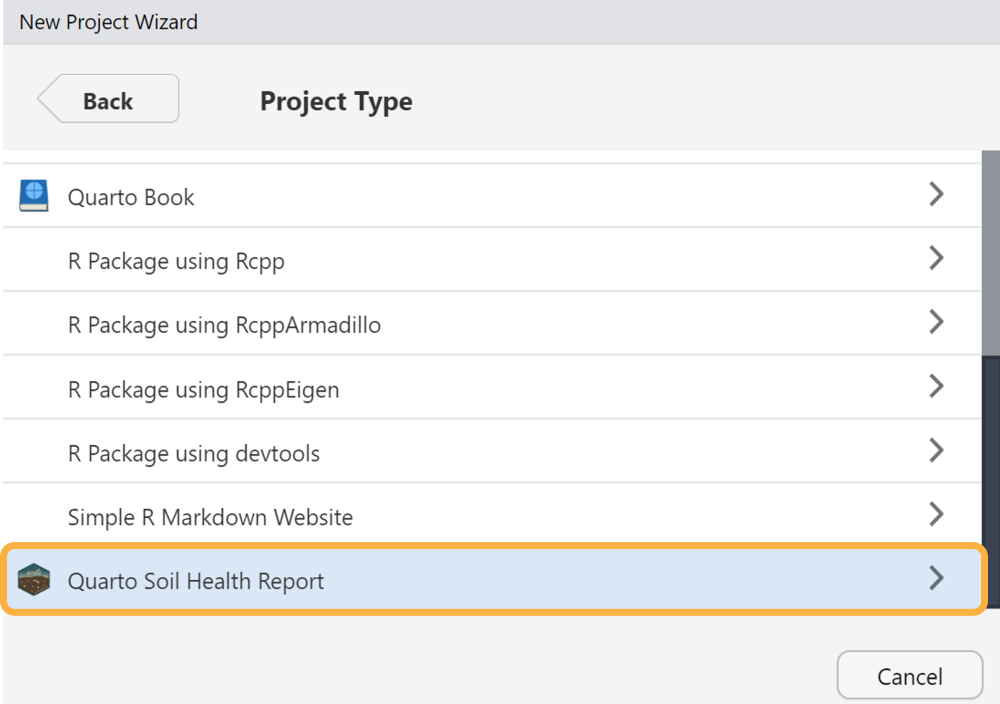
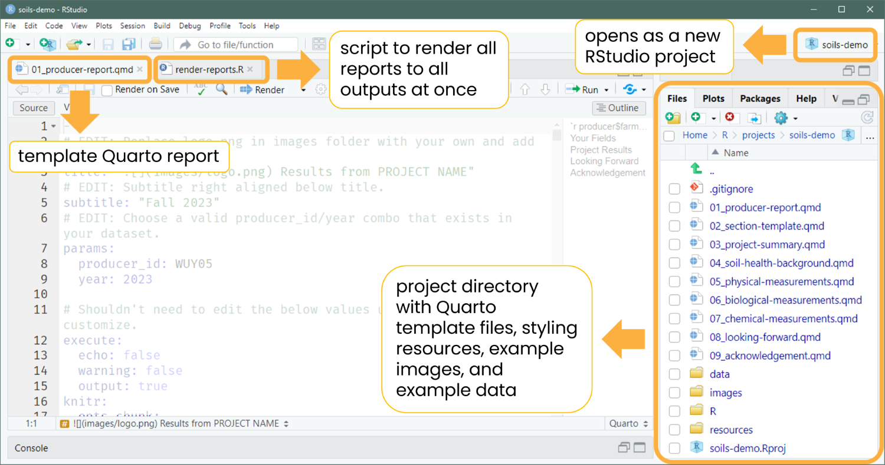

# Create a {soils} project

There are two ways to create a {soils} project. The below examples
create a project titled “soils-demo”. Replace this name with what you’d
like the project and directory to be named.

## Option 1. RStudio project wizard

The RStudio user interface is the easiest and recommended way to create
a new {soils} project.

`Open RStudio` \> `File` \> `New Project` \> `New Directory` \>
**`Quarto Soil Health Report`**



Enter your desired directory name, browse to where you want the project
to live, choose which template to use (currently the options are
*English* or *Spanish*), and check whether you want the project to open
in a new RStudio session.


The new RStudio project will open with the template Quarto report
(`01_producer-report.qmd`) and the R script (`render-reports.R`) to
render all reports at once. The rest of the project files will appear in
the files pane.



Demo video

## Option 2. RStudio console

Run the below code in your console to create a {soils} project called
“soils-demo” in your default working directory.

``` r
soils::create_soils(path = "soils-demo")
```

The following will print in your console. Note the location of your new
project.


## Project structure

Both options will create and launch a new RStudio project with the below
files.

Project directory and files

    ├── 01_producer-report.qmd
    ├── 02_section-template.qmd
    ├── 03_project-summary.qmd
    ├── 04_soil-health-background.qmd
    ├── 05_physical-measurements.qmd
    ├── 06_biological-measurements.qmd
    ├── 07_chemical-measurements.qmd
    ├── 08_looking-forward.qmd
    ├── 09_acknowledgement.qmd
    ├── data
    │   ├── data-dictionary.csv
    │   └── washi-data.csv
    ├── images
    │   ├── biological.png
    │   ├── chemical.png
    │   ├── logo.png
    │   └── physical.png
    ├── R
    │   └── render-reports.R
    ├── resources
    │   ├── styles.css
    │   └── word-template.docx
    └── soils-demo.Rproj
