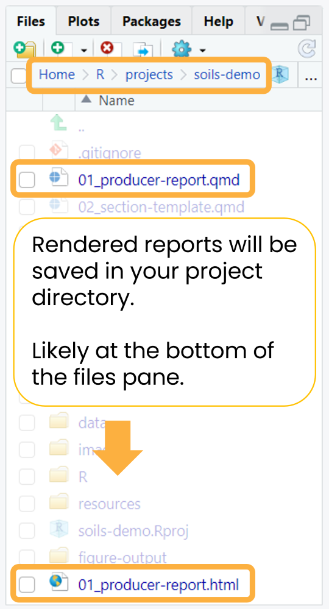

# Render the example reports

**Before modifying anything** (data, report content, or style), render
the example report with the anonymized built-in data to ensure your
system is set up correctly.

Open `01_producer-report.qmd`. Click the `Render` button to generate an
HTML report or the `down arrow` (▼) to open a drop down menu to choose
between HTML or MS Word. Try rendering the example report in both
formats.

If rendering to HTML, you can check the `Render on Save` option to
automatically update the preview whenever you save the document.

If the rendered report doesn’t immediately open, you can find it in your
project directory with the same name as the main Quarto `.qmd` file
(`01_producer-report.qmd`). Newly rendered files can usually be found at
the bottom of the files pane.

It should take no more than one minute to render a single example
report.

Demo videos

**HTML**

**MS Word**

**See the [rendered example
reports](https://wa-department-of-agriculture.github.io/soils/articles/examples.html).**
