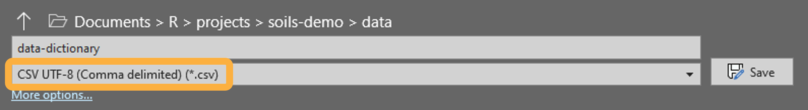

```{r, include = FALSE}
knitr::opts_chunk$set(
  collapse = TRUE,
  comment = "#>"
)
```

You can immediately install {soils}, create a new template project, and render
example reports, as demonstrated in the last two tutorials. However, you will
need to customize and edit the content to fit your project, shown in the next
three tutorials: [**Customize &
write**](https://wa-department-of-agriculture.github.io/soils/articles/customize.html),
[**Render
reports**](https://wa-department-of-agriculture.github.io/soils/articles/render.html),
and
[**Troubleshoot**](https://wa-department-of-agriculture.github.io/soils/articles/troubleshoot.html).

## Access the example datasets

An example dataset and data dictionary are included in every {soils} project.
Access the `.csv` files in the `data` folder, or load the package and call the
dataframes by name as shown below.

<details closed>

<summary>Load {soils} and see first five rows of each dataframe</summary>

```{r}
library(soils)
head(washi_data, 5) |> knitr::kable()
head(data_dictionary, 5) |> knitr::kable()
```

</details>

Use `washi_data` and `data_dictionary` as templates when formatting your own
data to use in {soils} functions and reports.

## Data template

Your data must contain the below required columns and each soil measurement must
be in its own column, as shown in `washi_data`.

<details closed>

<summary>Glimpse at the example data</summary>

```{r}
dplyr::glimpse(washi_data)
```

</details>

Your data **must have the below required columns**. However, only the columns in
**bold** are required to have values. Put another way, your data must have these
column names, even if every row is blank. Otherwise, the `data-validation` chunk
in `01_producer-report.qmd` or {soils} functions will error. For more details,
see [Data/dictionary mismatches].

-   **`year <int>`** is used to select samples to be included in the report.

-   **`sample_id <chr>`** must be unique throughout the dataset.

-   `farm_name <chr>` is included at the top of the report. If blank, it is
    replaced with "Farm: `producer_id`".

-   **`producer_id <chr>`** is used to select samples to be included in the
    report.

-   `field_name <chr>` must be unique across all fields for each producer and is
    displayed in tables and tool tips for maps. If blank, it is replaced with
    "Field `field_id`".

-   **`field_id <chr>`** must be unique across all fields for each producer.

-   `county <chr>` is used to group and summarize samples from the same county
    as the producer. Can be blank.

-   `crop <chr>` is used to group and summarize samples from the same crop as
    the producer. Can be blank.

-   `longitude <int>` and `latitude <int>` are used to map each sample point
    using the [{leaflet}](https://rstudio.github.io/leaflet/index.html) package.
    Coordinates must be in decimal degrees using WGS 84 (aka EPSG:4326). If
    blank, the map will not be included.

-   **`texture <chr>`** is used in the "physical" measurement group table. This
    column is not used in the texture triangle plot, which is instead created
    from percentage sand, silt, and clay measurement results.

-   **Each soil measurement** must have its own column in the dataset and a
    corresponding row in the data dictionary, as shown in [Dictionary template].

    -   Measurement columns come **after** the required columns for easy
        selection in the [`tidy-long` chunk].

## Dictionary template

The data dictionary is used to group and order soil measurements, and to nicely
format labels in tables and plots. The example `data_dictionary` contains
[UTF-8](https://www.unicode.org/faq/utf_bom.html) encoded superscripts,
subscripts, and special characters.

To properly encode your data dictionary as UTF-8, save it to the `data` folder
as `CSV UTF-8 (Comma delimited) (*.csv)` in MS Excel.

{fig-alt="Data dictionary is saved as CSV UTF-8 (Comma delimited) (*.csv) in MS Excel."}

<details closed>

<summary>Glimpse at the example data dictionary</summary>

```{r}
dplyr::glimpse(data_dictionary)
```

</details>

Your data dictionary **must have the below required columns** for every soil
measurement included in your data.

-   **`measurement_group <chr>`** determines how the soil measurements are
    grouped. The order in which these groups appear in the report is determined
    by the order they are listed within the data dictionary.

-   **`column_name <chr>`** is used to join the dictionary with your data. Must
    exactly match the column names of the soil measurements in your dataset. The
    order in which these measurements appear within their `measurement_group` is
    determined by the order they are listed within the data dictionary.

-   **`abbr <chr>`** and **`unit <chr>`** are how soil measurements are labeled
    in tables with the abbreviation as the column header and unit as a secondary
    spanning header.

## Data/dictionary mismatches

Getting your data and dictionary in the proper format to render the report
without errors will likely be the most difficult part of making {soils} work for
your project.

The [`data-validation` chunk] and many {soils} functions include
`testthat::expect_contains()` to fail early if required columns are missing from
either the data or the dictionary. This early failure saves time by stopping as
soon as the missing column or data/dictionary mismatch is identified.
Additionally, these early failed tests provide the `expected` versus `actual`
values, making it easier to correct the issue with minimal debugging.

Below are some common issues that arise and possible workarounds. These
workarounds may make more sense after reviewing the [Your data] section that
includes example errors and fixes.

### Extra columns in data

**Soil measurements in your data but not in your dictionary** will cause the
report to error in the `data-validation` chunk. For example, rendering the
report will fail if your dataset contains both `pH` and `CEC` results but your
dictionary only contains `pH`. Either add the `CEC` measurement to your
dictionary or remove this measurement column from your data. If you don't want
to delete the column from your datasheet, you can remove it from only the data
object with `data <- dplyr::select(data, -cec_meq_100g)` perhaps in the
`load-data` chunk.

**Additional metadata columns in your data** will also cause the report to error
in the `data-validation` chunk. For example, if you have a column `phone_number`
with producer phone numbers that won't be used in the report, remove it from the
data with the `data <- dplyr::select(data, -c(cec_meq_100g, phone_number))`. If
you want to use this column in the report, then add it to the `required_cols`
vector of the [`data-validation` chunk] so that the `testthat` function doesn't
error.

### Extra rows in dictionary

**Soil measurements in your dictionary but not in your data** will not error and
will not affect the report. For example, the report will simply show the `pH`
results if your dictionary contains both `pH` and `CEC` but your data only
contains `pH` results.

## Your data

Once your project data and dictionary files match the structure of the examples
and are saved in the `data` folder, follow along with the changes in the code
chunks in `01_producer-report.qmd`. Code you will need to change are marked with
the text "`EDIT:`". Find all edit markers in the RStudio project with `Ctrl` +
`Shift` + `F` to open the `Find in Files` wizard.

Below changes are for demonstration purposes only, the actual changes should be
based on **your** data and dictionary.

### `load-data` chunk

Replace `washi-data.csv` with the name of your data file (`my-data.csv`).

<details closed>

<summary>Example changed chunk</summary>

```{r load-data, eval=FALSE}
# EDIT: Add your cleaned lab data to the data folder, using 'washi-data.csv' as
# a template.

# Load lab results
data <- read.csv(
  here::here("data/my-data.csv"),
  check.names = FALSE,
  encoding = "UTF-8",
  strip.white = TRUE
)
```

</details>

### `load-dictionary` chunk

Change `data-dictionary.csv` to the name of your dictionary file
(`my-dictionary.csv`). If using subscripts, superscripts, or special characters,
make sure your csv is saved with UTF-8 encoding (see [Dictionary template] for
how to do this).

<details closed>

<summary>Example changed chunk</summary>

```{r load-dictionary, eval=FALSE}
# EDIT: Add your data dictionary to the data folder, using 'data-dictionary.csv'
# as a template.

# Load data dictionary
dictionary <- read.csv(
  here::here("data/my-dictionary.csv"),
  check.names = FALSE,
  # Set encoding for using subscripts, superscripts, special characters
  encoding = "UTF-8",
  strip.white = TRUE
)
```

</details>

### `tidy-long` chunk

Replace the column range of the soil measurements from the example
`washi-data.csv` (`12:42`) with the column range of the soil measurements in
your data (`12:26`). This chunk [tidies the
data](https://vita.had.co.nz/papers/tidy-data.pdf) from wide to long for
summarization and visualization.

<details closed>

<summary>Example changed chunk</summary>

```{r tidy-long, eval=FALSE}
# EDIT: `washi_data` example has soil measurements in columns 12 - 42. Replace
# this column range with the column indices of the soil measurements in your
# dataset.

# Tidy data into long format and join with data dictionary
results_long <- data |>
  dplyr::mutate(
    dplyr::across(
      # EDIT: replace with the column range of your soil measurements
      12:26,
      as.numeric
    )
  ) |>
  tidyr::pivot_longer(
    # EDIT: replace with the column range of your soil measurements
    cols = 12:26,
    names_to = "measurement"
  )
```

</details>

### `data-validation` chunk

This chunk checks there are no mismatches as described in [Data/dictionary
mismatches] by making sure all column names in your dataset are in either the
`required_cols` vector or the `column_name` column of `my-dictionary.csv`.

In this example, add an extra column named `tillage` in `my-data.csv` without
changing the dictionary.

After clicking the `Render` button, the report failed.

``` r
Quitting from lines 94-115 [data-validation] (01_producer-report.qmd)
Error:
! names(data) (`actual`) isn't fully contained within c(required_cols, dictionary$column_name) (`expected`).
* Missing from `expected`: "tillage"
* Present in `expected`:   "year", "sample_id", "farm_name", "producer_id", "field_name", "field_id", "county", "crop", "longitude", ...
```

This error message says the error occurred in lines 94-115 in the
`data-validation` chunk because `tillage` was missing from the `expected`
values, which are elements of `required_cols` and `dictionary$column_name`.

Adding `"tillage"` to `required_cols` prevents this error.

<details closed>

<summary>Example changed chunk</summary>

```{r data-validation-changed, eval=FALSE}
# OPTIONAL EDIT: If you have extra columns in `data`, add them to this vector.
required_cols <- c(
  "year",
  "sample_id",
  "farm_name",
  "producer_id",
  "field_name",
  "field_id",
  "county",
  "crop",
  "longitude",
  "latitude",
  "texture",
  "tillage"
)

# Check all column names in `data` are in the `required_cols` vector or
# `column_name` column of `dictionary`.
testthat::expect_in(names(data), c(required_cols, dictionary$column_name))
```

</details>

To demonstrate another data/dictionary mismatch error, remove `cec_meq_100g`
from the dictionary while keeping it in the dataset.

``` r
Quitting from lines 94-115 [data-validation] (01_producer-report.qmd)
Error:
! names(data) (`actual`) isn't fully contained within c(...) (`expected`).
* Missing from `expected`: "cec_meq_100g"
* Present in `expected`:   "year", "sample_id", "farm_name", "producer_id", "field_name", "field_id", "county", "crop", "texture", ...
```

The error occurred because `cec_meq_100g` was missing from the `expected`
values. Either add `cec_meq_100g` back to the dictionary or remove this column
from the dataset to fix this error.

**See the [troubleshooting
article](https://wa-department-of-agriculture.github.io/soils/articles/troubleshoot.html)
for more help on debugging errors.**
article](<https://wa-department-of-agriculture.github.io/soils/articles/troubleshoot.html>)
for more help on debugging errors.\*\*
