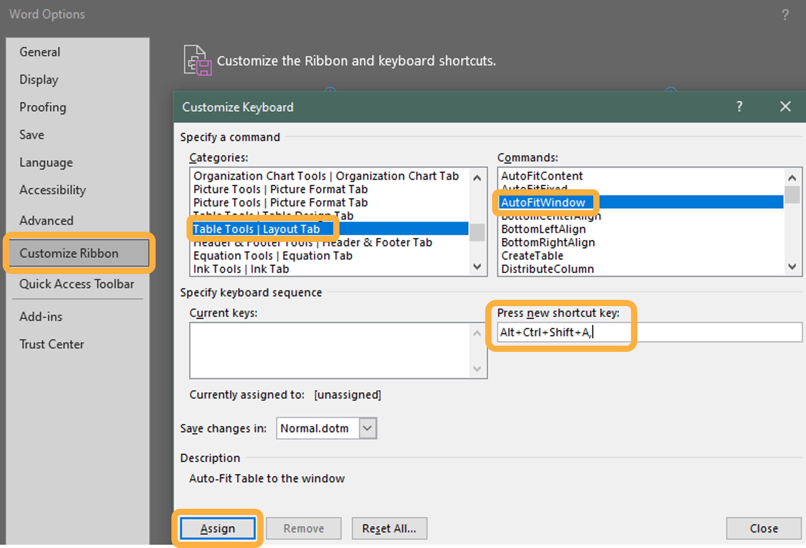

```{r setup, echo=FALSE}
knitr::opts_chunk$set(
  echo = FALSE,
  out.width = "150%"
)
```

```{=html}
<style>

.tabset-pills .tab-content {
    border: 0px;
}

</style>
```
## Example Reports

The below examples show the output with and without these edits.

##  {.tabset .tabset-pills}

### Manual Formatting Edits

See this manually formatted report full screen in a [new tab](https://rawcdn.githack.com/WA-Department-of-Agriculture/soils/2206de2c25ab7da9a097c9e16312d1d1783c1750/inst/example_reports/example_producer_report.pdf "See the manually edited .docx report without edits in full screen."){target="_blank"}.

```{r}
knitr::include_url("https://rawcdn.githack.com/WA-Department-of-Agriculture/soils/2206de2c25ab7da9a097c9e16312d1d1783c1750/inst/example_reports/example_producer_report.pdf", height = "500px")
```

### Without Edits

See the original rendered report full screen in a [new tab](https://rawcdn.githack.com/WA-Department-of-Agriculture/soils/2206de2c25ab7da9a097c9e16312d1d1783c1750/inst/example_reports/example_producer_report_noManualEdits.pdf "See the original .docx report without edits in full screen."){target="_blank"}.

```{r}
knitr::include_url("https://rawcdn.githack.com/WA-Department-of-Agriculture/soils/2206de2c25ab7da9a097c9e16312d1d1783c1750/inst/example_reports/example_producer_report_noManualEdits.pdf", height = "500px")
```

## Manual Formatting Edits

After rendering to `.docx`, the reports were opened in MS Word for manual formatting edits:

-   Changed images to float around text.
-   Tables were `autofit` by going to `Layout` \> `AutoFit` \> `AutoFit Window`.
-   Adjust plot sizes and page breaks so each measurement group's table and plot fit on one page.

After manually adjusting each image to float around the text for the first report, we copied and pasted the static pages of project background to the other reports. This reduced some of the tedious point and click formatting.

We added a keyboard shortcut for autofitting the wide tables:

In MS Word \> `File` \> `Options` \> `Customize Ribbon`.

Open the `Customize Keyboard` dialog box by clicking `Keboard shortcuts: Customize`.

Then select `Categories: Table Tools | Layout Tab` \> `Commands: AutoFitWindow` \> `Press new shortcut key: Alt+Ctrl+Shift+A` \> `Assign`.

Click in each table and use your new shortcut to autofit to the window.



In the future, we would like to create a template using `LaTex` to render `.pdf` reports that have better controls for floating images around text and fitting tables and plots to avoid the intermediate `.docx` step.

These example reports were rendered to `.docx` files and then converted to PDFs for web publishing.
