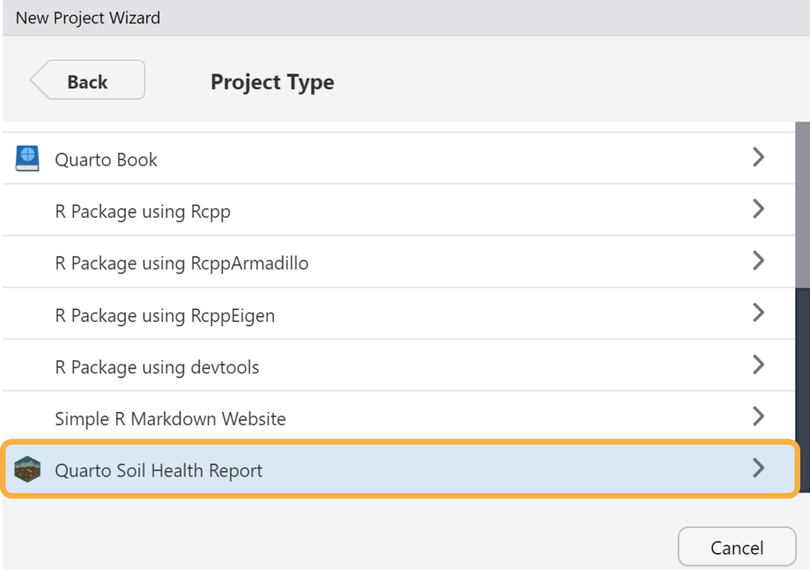
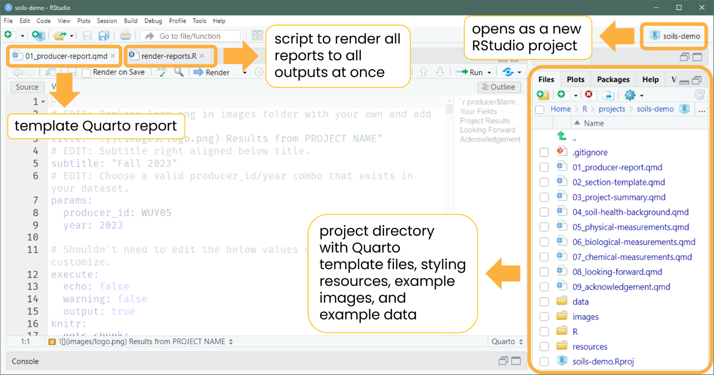

```{r options, include = FALSE}
knitr::opts_chunk$set(
  collapse = TRUE,
  comment = "#>"
)
```

## Installation

Install the development version of {soils} from our [r-universe](https://wa-department-of-agriculture.r-universe.dev/) with:

```{r install-r-universe, eval=FALSE}
install.packages(
  "usethis",
  repos = c(
    "https://wa-department-of-agriculture.r-universe.dev",
    "https://cloud.r-project.org",
    "https://ftp.osuosl.org/pub/cran/",
    "https://mirrors.dotsrc.org/cran/"
  )
)
```

## Create the Project

There are two ways to create the {soils} project in RStudio.

### Option 1. RStudio Project Wizard

The easiest and recommended way is to use the RStudio IDE to create a new {soils} RStudio project.

`Open RStudio` \> `File` \> `New Project` \> `New Directory` \> **`Quarto Soil Health Report`**

{fig-alt="Screenshot of RStudio New Project Wizard with Quarto Soil Health Report selected."}

Enter your desired directory name, browse to where you want the project to live, and check whether you want the project to open in a new RStudio session.

{fig-alt="Screenshot of RStudio New Project Wizard for Quarto Soil Health Report. Enter directory name, path, and check whether you want the project to open in a new RStudio session."}

A new RStudio project will open with the template Quarto report and a script to render all reports. Other documents and resources will appear in the files pane.

{fig-alt="Screenshot of new RStudio project called demo-soils. A Quarto file called producer_report.qmd is open and there is a tab for an R script called render_reports.R that renders all reports at once. The files pane is open with a project directory full of other Quarto files, styling resources, example images and data."}

### Option 2. RStudio Console

In the console, replace the path with where you would like the project directory to be created:

```{r, eval=FALSE}
soils::create_soils(path = here::here("soils-demo"))
```

The following will print in your console:

{fig-alt="Output from running soils::create_soils(path = here::here('soils-demo')) in the RStudio console"}

This option populates your project directory with all the template files; however, it doesn't open the main template Quarto file `01_producer_report.qmd` or R script `render_reports.R`.

## Project Structure

Both options will create and launch a new RStudio project with the following files:

<details open>

<summary>Project Directory and Files</summary>

```         
├── 01_producer_report.qmd
├── 02_section_template.qmd
├── 03_project_summary.qmd
├── 04_soil_health_background.qmd
├── 05_physical_measurements.qmd
├── 06_biological_measurements.qmd
├── 07_chemical_measurements.qmd
├── 08_looking_forward.qmd
├── 09_acknowledgement.qmd
├── data
│   ├── dataDictionary.csv
│   └── exampleData.csv
├── images
│   ├── biological.png
│   ├── chemical.png
│   ├── logo.png
│   └── physical.png
├── R
│   └── render_reports.R
├── resources
│   ├── styles.css
│   └── word-template.docx
└── soils-demo.Rproj
```

</details>

## Render the Example Report

Let's render the example report with the dummy built-in data without making any changes just to make sure your system is set up correctly. Open `01_producer_report.qmd` and click the `Render` button at the top of the file to generate either the HTML or MS Word report.

If rendering to HTML, you can check the `Render on Save` option to automatically update the preview whenever you save the document.

{fig-alt="RStudio Quarto Render button with a dropdown for HTML and MS Word. Render on Save option is checked."}

This will render the [MS Word Example](https://wa-department-of-agriculture.github.io/soils/articles/docx.html) or [HTML Example](https://wa-department-of-agriculture.github.io/soils/articles/html.html), depending on which render option you selected.

If the rendered report doesn't immediately open, you can find it in your project directory with the same name as the main Quarto `.qmd` file (`01_producer_report.qmd`.

{fig-alt="RStudio screenshot of files pane with boxes around the project directory and the two rendered producer reports titled 01_producer_report.html and 01_producer_report.docx."}

## Render a Report with Your Data

Now try rendering the report with your own data.

1.  Open the `data` folder and look at the `exampleData.csv` and `dataDictionary.csv`.

2.  Use these as templates to replicate the column names and structure of these CSV files with your own data. All column names besides the measurements columns must be exactly the same. The measurement column names in your data must match the values in the `column_name` column in your data dictionary.

3.  Update the load data chunk with the names of your data and data dictionary CSV files.

{fig-alt="Lines 59-71 and 92-98 of 01_producer_report.qmd with boxes and arrows pointing at read.csv functions to import the data and dictionary. A text box says 'replace with your file names'."}

4.  At the top of `01_producer_report.qmd`, update the `producerId` and `year` to a valid combination that exists in your own data.

{fig-alt="Lines 6-9 of 01_producer_report.qmd showing the params, producerId, and year key-value pairs to change in the YAML."}

5.  Click `Render` in RStudio.

For more details on customizing the report template for your own project, head over to the article [Customize the Template](https://wa-department-of-agriculture.github.io/soils/articles/customize-template.html).
