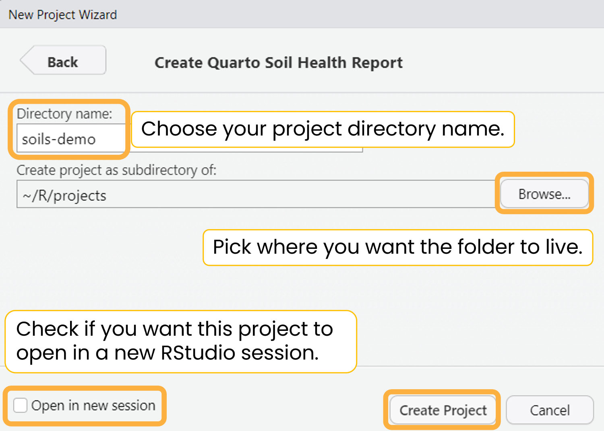
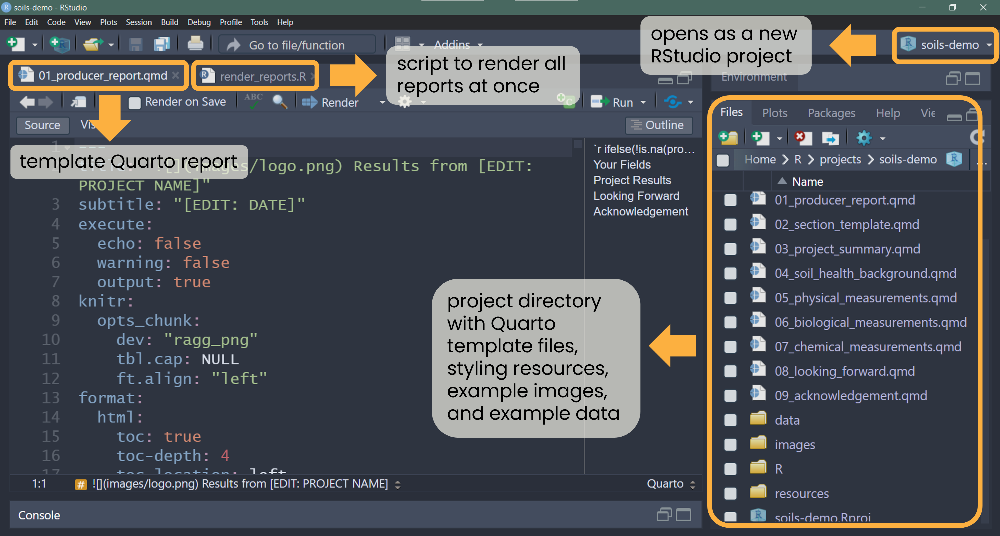
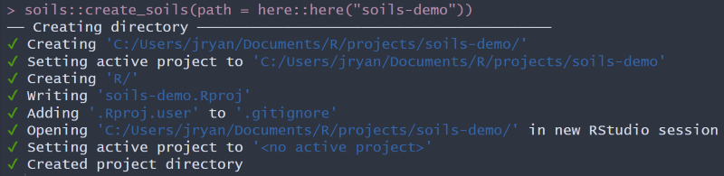

```{r, include = FALSE}
knitr::opts_chunk$set(
  collapse = TRUE,
  comment = "#>"
)
```

There are two ways to create a {soils} project. The below examples create a
project titled "soils-demo". Replace this name with what you'd like the project
and directory to be named.

## Option 1. RStudio project wizard

The RStudio user interface is the easiest and recommended way to create a new
{soils} project.

`Open RStudio` \> `File` \> `New Project` \> `New Directory` \>
**`Quarto Soil Health Report`**

{width="70%"
fig-alt="Screenshot of RStudio New Project Wizard with Quarto Soil Health Report selected."}

Enter your desired directory name, browse to where you want the project to live,
choose which template to use (currently the options are *English* or *Spanish*),
and check whether you want the project to open in a new RStudio session.

{width="70%"
fig-alt="Screenshot of RStudio New Project Wizard for Quarto Soil Health Report. Enter directory name, path, choose which template type to use, and check whether you want the project to open in a new RStudio session."}

The new RStudio project will open with the template Quarto report
(`01_producer-report.qmd`) and the R script (`render-reports.R`) to render all
reports at once. The rest of the project files will appear in the files pane.

{fig-alt="Screenshot of new RStudio project called demo-soils. A Quarto file called 01_producer-report.qmd is open and there is a tab for an R script called render_reports.R that renders all reports at once. The files pane is open with a project directory full of other Quarto files, styling resources, example images and data."}

<details closed>

<summary>Demo video</summary>

<iframe src="https://drive.google.com/file/d/1LsuC4YR0rXjBUEk4eeoIaoYbaLGcARzr/preview" width="640" height="360" allow="autoplay">

</iframe>

</details>

## Option 2. RStudio console

Run the below code in your console to create a {soils} project called
"soils-demo" in your default working directory.

```{r, eval=FALSE}
soils::create_soils(path = "soils-demo")
```

The following will print in your console. Note the location of your new project.

{fig-alt="Output from running soils::create_soils(path = 'soils-demo') in the RStudio console"}

## Project structure

Both options will create and launch a new RStudio project with the below files.

<details closed>

<summary>Project directory and files</summary>

```         
├── 01_producer-report.qmd
├── 02_section-template.qmd
├── 03_project-summary.qmd
├── 04_soil-health-background.qmd
├── 05_physical-measurements.qmd
├── 06_biological-measurements.qmd
├── 07_chemical-measurements.qmd
├── 08_looking-forward.qmd
├── 09_acknowledgement.qmd
├── data
│   ├── data-dictionary.csv
│   └── washi-data.csv
├── images
│   ├── biological.png
│   ├── chemical.png
│   ├── logo.png
│   └── physical.png
├── R
│   └── render-reports.R
├── resources
│   ├── styles.css
│   └── word-template.docx
└── soils-demo.Rproj
```

</details>

