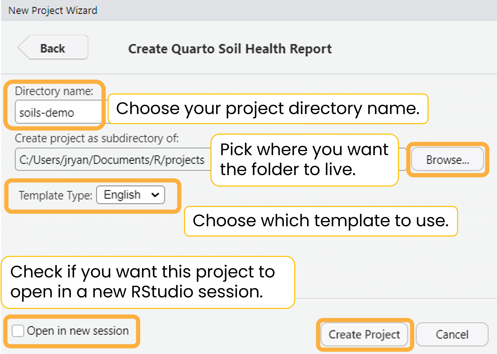

```{r, include = FALSE}
knitr::opts_chunk$set(
  collapse = TRUE,
  comment = "#>"
)
```

## Create the project

There are two ways to create the {soils} project in RStudio.

### Option 1. RStudio project wizard

The easiest and recommended way is to use the RStudio IDE to create a new {soils} RStudio project.

<iframe src="https://drive.google.com/file/d/1My0E5fq5HipvCFCRQyQ4DBmbnqt5KlwV/preview" width="640" height="360" allow="autoplay; fullscreen;">

</iframe>

<br>

<details closed>

<summary>Step-by-step screenshots</summary>

<br> `Open RStudio` \> `File` \> `New Project` \> `New Directory` \> **`Quarto Soil Health Report`**

{fig-alt="Screenshot of RStudio New Project Wizard with Quarto Soil Health Report selected."}

Enter your desired directory name, browse to where you want the project to live, and check whether you want the project to open in a new RStudio session.

{fig-alt="Screenshot of RStudio New Project Wizard for Quarto Soil Health Report. Enter directory name, path, and check whether you want the project to open in a new RStudio session."}

A new RStudio project will open with the template Quarto report and a script to render all reports. Other documents and resources will appear in the files pane.

{fig-alt="Screenshot of new RStudio project called demo-soils. A Quarto file called 01_producer-report.qmd is open and there is a tab for an R script called render_reports.R that renders all reports at once. The files pane is open with a project directory full of other Quarto files, styling resources, example images and data."}

</details>

### Option 2. RStudio console

Run the below code in your console to create a {soils} project in your default working directory:

```{r, eval=FALSE}
soils::create_soils(path = "soils-demo")
```

The following will print in your console, note the location of your new project:

{fig-alt="Output from running soils::create_soils(path = 'soils-demo') in the RStudio console"}

## Project structure

Both options will create and launch a new RStudio project with the following files:

<details closed>

<summary>Project directory and files</summary>

```         
├── 01_producer-report.qmd
├── 02_section-template.qmd
├── 03_project-summary.qmd
├── 04_soil-health-background.qmd
├── 05_physical-measurements.qmd
├── 06_biological-measurements.qmd
├── 07_chemical-measurements.qmd
├── 08_looking-forward.qmd
├── 09_acknowledgement.qmd
├── data
│   ├── data-dictionary.csv
│   └── washi-data.csv
├── images
│   ├── biological.png
│   ├── chemical.png
│   ├── logo.png
│   └── physical.png
├── R
│   └── render-reports.R
├── resources
│   ├── styles.css
│   └── word-template.docx
└── soils-demo.Rproj
```

</details>

## Render the example reports

Render the example report with the dummy built-in data without making any changes to make sure your system is set up correctly.

**See the [rendered example reports](https://wa-department-of-agriculture.github.io/soils/articles/examples.html).**

### HTML

<iframe src="https://drive.google.com/file/d/1qlU0w2EN7nzoH2OGzRWEqhan-g9dVh7e/preview" width="640" height="360" allow="autoplay; fullscreen;">

</iframe>

### MS Word

<iframe src="https://drive.google.com/file/d/1F6PfWzODkTq0j5cVSwagcUMTXkCMhrIr/preview" width="640" height="360" allow="autoplay;fullscreen;">

</iframe>

<br>

<details closed>

<summary>Step-by-step screenshots</summary>

<br> Open `01_producer-report.qmd` and click the `Render` button at the top of the file to generate either the HTML or MS Word report.

If rendering to HTML, you can check the `Render on Save` option to automatically update the preview whenever you save the document.

{fig-alt="RStudio Quarto Render button with a dropdown for HTML and MS Word. Render on Save option is checked."}

If the rendered report doesn't immediately open, you can find it in your project directory with the same name as the main Quarto `.qmd` file (`01_producer-report.qmd`). The file will likely be at the top or bottom of your RStudio files pane, depending on how you have your files sorted.

{fig-alt="RStudio screenshot of files pane with boxes around the project directory and the two rendered reports titled 01_producer-report.html and 01_producer-report.docx."}

</details>
