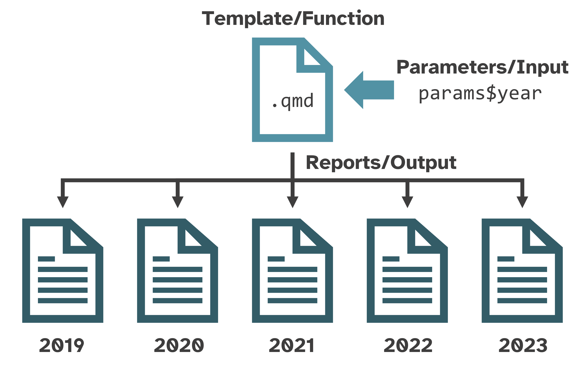

```{r, include = FALSE}
knitr::opts_chunk$set(
  collapse = TRUE,
  comment = "#>"
)
```

If you're new to Quarto, first check out the [**Hello, Quarto
tutorial**](https://quarto.org/docs/get-started/hello/rstudio.html) and explore
the documentation.

This primer is not a comprehensive introduction to Quarto. Instead, it provides
a brief reference for workflows and features used in {soils}.

# File paths

`soils::create_soils(path = "soils-demo")` creates an RStudio Project called
"soils-demo" with the template Quarto (`.qmd`) files, example data, R script,
images, style sheets, and the `.Rproj` file that designates the directory as an
RStudio Project. All template files use **relative paths** instead of absolute
paths to ensure the file paths work on anyone's computer.

## Absolute vs relative paths

❌ **Absolute paths** start with the root directory and provide the full path to
a specific file or folder
(`C:/Users/jryan/Documents/R/projects/soils-demo/data/washi-data.csv`). This
path **will not work** on anyone's computer unless the operating system, user,
directory structure, and folder names match exactly.

✅ **Relative paths** are *relative* to the working directory, or the project's
home (`data/washi-data.csv`). When working in a RStudio project, the default
working directory is always the root project directory (where the `.Rproj` file
is). This path **will work** on anyone's computer with this project directory.

## {here} package

When a Quarto file renders, its default current working directory is where the
`.qmd` file lives. To make code more robust, the
[{here}](https://here.r-lib.org/) package builds *relative* file paths and takes
care of the backslashes or forward slashes so the path will work no matter the
operating system.

For example, in our new {soils} project, `01_producer-report.qmd` imports data
using `read.csv(here::here("data/washi-data.csv"))`.

# Parameterized reporting

{soils} uses Quarto to help you generate **parameterized** reports for each
participant in your survey from the same template file.

Parameterized reports are like complex functions where the **function** is the
`.qmd` template, the **input** are the parameters, and the **output** are the
reports.

{fig-alt="A diagram showing parameters/input with an arrow pointing to a Quarto file as the template/function. Many arrows lead from the Quarto file to the reports/output as five different reports representing five different years."}

To learn more about parameterized reporting, see the materials for [Jadey Ryan's
20-minute
presentation](https://jadeyryan.com/talks/2023-09-25_posit_parameterized-quarto/),
follow along with her [2-hour code-along
workshop](https://jadeyryan.quarto.pub/rladies-dc-quarto-params/), or read the
[Quarto parameters
documentation](https://quarto.org/docs/computations/parameters.html).

# Quarto specific features

{soils} uses several intermediate to advanced Quarto features, listed below with
references for further reading.

## Shortcodes

Shortcodes are special markdown directives that generate various types of
content. The markdown syntax uses the shortcode name and attributes inside angle
brackets that are nested inside double curly braces ``. Read
more in the [Shortcodes
article](https://quarto.org/docs/extensions/shortcodes.html).

### Pagebreak

`pagebreak` inserts native page breaks into a document regardless of the report
format (e.g., HTML, MS Word). Read more in the [Pagebreaks
article](https://quarto.org/docs/authoring/markdown-basics.html#page-breaks).

``` r

```

### Include

`include` embeds content from a separate `.qmd` file into the main report. This
shortens the number of lines in the main `.qmd` file and makes the markdown and
code of the project more modular. Read more in the [Includes
article](https://quarto.org/docs/authoring/includes.html).

Examples found in `01_producer-report.qmd` are shown below.

``` r



```

## `knitr::knit_child()`

The include shortcode is limited and cannot generate dynamic sections from an
"included" Quarto file. {soils} uses the `knitr::knit_child()` function as a
workaround, thanks to [Quishi Yan's blog
post](https://www.qiushiyan.dev/posts/dynamic-rmd-quarto/).

For each measurement group results section, `02_section-template.qmd` is used as
a template to generate each section's header, table, plot, and page break.

The below code is in the `create-measurement-group-sections` code chunk of
`01_producer-report.qmd`.

```{r eval=FALSE}
#| output: asis

sections <- purrr::map_chr(measurement_groups, \(group) {     # <1>
  knitr::knit_child(
    input = "02_section-template.qmd",
    envir = rlang::env(),
    quiet = TRUE
  )
})

cat(sections, sep = "\n")                                     # <2>
```

1.  `purrr::map_chr()` loops over each measurement group to generate its section
    as a child document.
2.  With the chunk option `#| output: asis` and the `cat(sections, sep = "\n")`
    line, the child documents are embedded within the main producer report.

## Divs and spans

Add classes and attributes to regions of content with divs and spans.

### Divs

Divs start and end with a fence containing *at least* three consecutive colons
(`:::`). The div should be separated by blank lines from preceding and following
blocks.

Divs may or may not use curly braces `{}` around the class and attributes. In
the below example, `columns` is a standalone class, while `.column width="50%"`
is a class with an attribute.

Divs may also be nested, as shown below. Optionally, more than three consecutive
colons to distinguish nested divs from their parents.

``` markdown
:::: columns

::: {.column width="50%"}
Left column
:::

::: {.column width="50%"}
Right column
:::

::::
```

### Spans

Bracketed text immediately followed by a class or attributes in curly braces
`{}` will be treated as a span.

```         
[Purple]{style="color:purple;font-weight: bold;font-size: x-large;"} is my favorite color.
```

is rendered as:
[Purple]{style="color:purple;font-weight: bold;font-size: x-large;"} is my
favorite color.

Read more in the [Divs and Spans
documentation](https://quarto.org/docs/authoring/markdown-basics.html#divs-and-spans).

## Conditional Content

Conditional content classes and attributes control whether content *is* or *is
not* displayed in a given format. For example, to control visibility for HTML
formats, use a div with the `.content-visible` class and the
`when-format="html"` OR `unless-format="html"` attribute. Read more in the
[Conditional Content
article](https://quarto.org/docs/authoring/conditional.html).

``` markdown
::: {.content-visible when-format="html"}
This interactive content will ONLY appear in HTML reports.
:::

::: {.content-visible unless-format="html"}
This static content will appear in all reports EXCEPT in HTML reports.
:::
```

## Tabsets

Tabsets work only in HTML documents and are created with the `::: panel-tabset`
div. Each top-level heading within the div creates a new tab. Read more in the
[Tabsets
article](https://quarto.org/docs/output-formats/html-basics.html#tabsets).

The below example shows how `04_soil-health-background.qmd` uses **include**
shortcodes, **nested divs**, **conditional content**, and a **tabset** to
include a tabset *only* for HTML reports.

``` markdown
::: {.content-visible when-format="html"}
:::: panel-tabset





::::
:::

::: {.content-visible unless-format="html"}





:::
```
