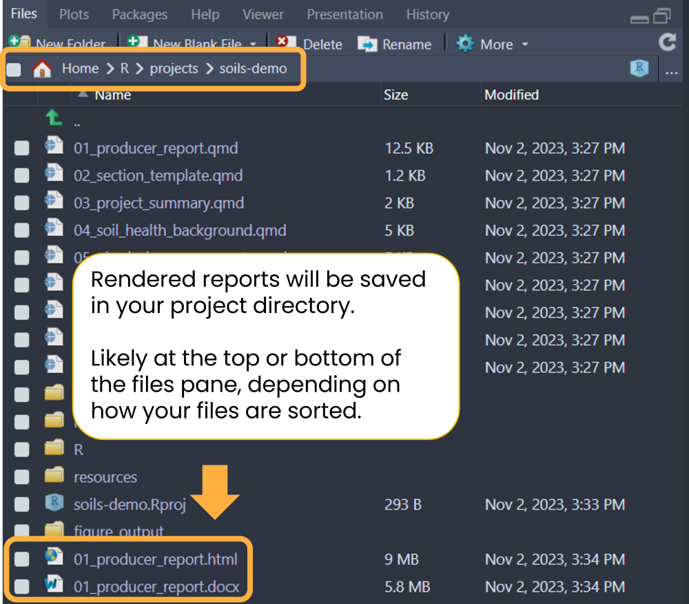

```{r, include = FALSE}
knitr::opts_chunk$set(
  collapse = TRUE,
  comment = "#>"
)
```

**Before modifying anything** (data, report content, or style), render the
example report with the anonymized built-in data to ensure your system is set up
correctly.

Open `01_producer-report.qmd`. Click the `Render` button to generate an HTML
report or the `down arrow` (▼) to open a drop down menu to choose between HTML
or MS Word. Try rendering the example report in both formats.

If rendering to HTML, you can check the `Render on Save` option to automatically
update the preview whenever you save the document.

{width="80%"
fig-alt="RStudio Quarto Render button with a dropdown for HTML and MS Word. Render on Save option is checked."}

If the rendered report doesn't immediately open, you can find it in your project
directory with the same name as the main Quarto `.qmd` file
(`01_producer-report.qmd`). Newly rendered files can usually be found at the
bottom of the files pane.

{width="50%"
fig-alt="RStudio screenshot of files pane with boxes around the project directory path, the template 01_producer-report.qmd file, and the rendered report 01_producer-report.html"}

It should take no more than one minute to render a single example report.

<details closed>

<summary>Demo videos</summary>

**HTML**

<iframe src="https://drive.google.com/file/d/1c1gMBT8j5oF-CNyL9FyTfzPqSTQCGEIJ/preview" width="640" height="360" allow="autoplay; fullscreen;">

</iframe>

**MS Word**

<iframe src="https://drive.google.com/file/d/1jZxmmtS-SYdvNQoG2teOTLBkyneDB9v_/preview" width="640" height="360" allow="autoplay">

</iframe>

</details>

**See the [rendered example
reports](https://wa-department-of-agriculture.github.io/soils/articles/examples.html).**
