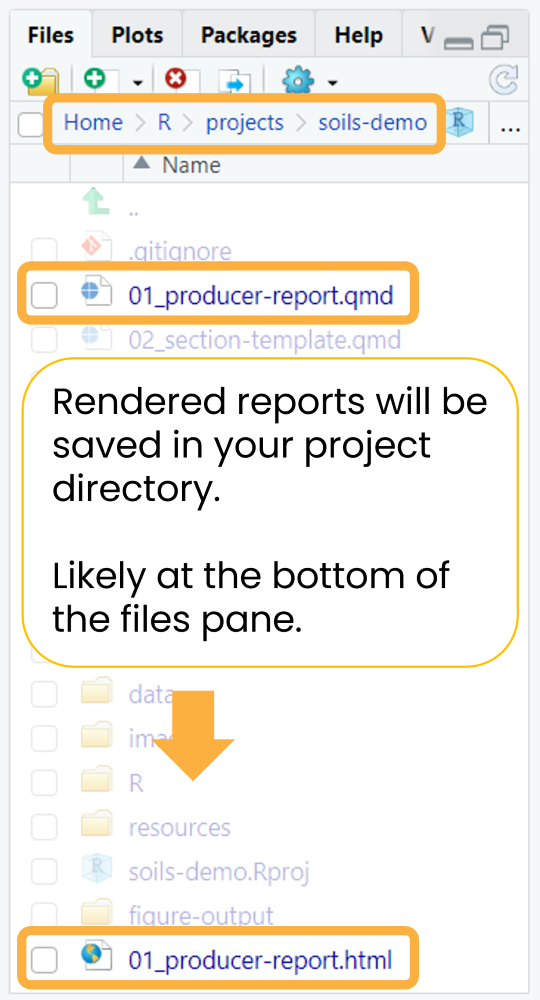

```{r, include = FALSE}
knitr::opts_chunk$set(
  collapse = TRUE,
  comment = "#>"
)
```

Render the example report with the dummy built-in data without making any changes to make sure your system is set up correctly.

Open `01_producer-report.qmd` and click the `Render` button at the top of the file to generate either the HTML or MS Word report.

If rendering to HTML, you can check the `Render on Save` option to automatically update the preview whenever you save the document.

{fig-alt="RStudio Quarto Render button with a dropdown for HTML and MS Word. Render on Save option is checked."}

If the rendered report doesn't immediately open, you can find it in your project directory with the same name as the main Quarto `.qmd` file (`01_producer-report.qmd`). The file will likely be at the top or bottom of your RStudio files pane, depending on how you have your files sorted.

{fig-alt="RStudio screenshot of files pane with boxes around the project directory and the two rendered reports titled 01_producer-report.html and 01_producer-report.docx."}

<details closed>

<summary>Demo videos</summary>

### HTML

<iframe src="https://drive.google.com/file/d/1qlU0w2EN7nzoH2OGzRWEqhan-g9dVh7e/preview" width="640" height="360" allow="autoplay; fullscreen;">

</iframe>

### MS Word

<iframe src="https://drive.google.com/file/d/1F6PfWzODkTq0j5cVSwagcUMTXkCMhrIr/preview" width="640" height="360" allow="autoplay;fullscreen;">

</iframe>

</details>

**See the [rendered example reports](https://wa-department-of-agriculture.github.io/soils/articles/examples.html).**

