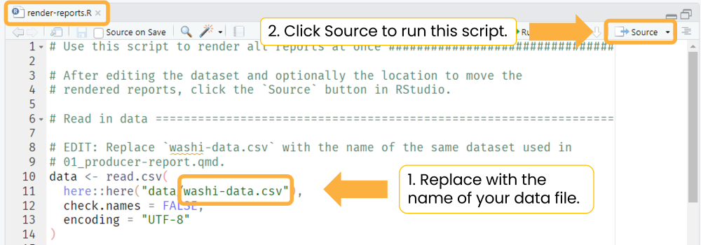

```{r, include = FALSE}
knitr::opts_chunk$set(
  collapse = TRUE,
  comment = "#>"
)
```

Render a single report at a time with the RStudio user interface, or
programmatically render all reports (for all producers and in all formats) with
the `render_reports.R` script.

## Using RStudio

To generate and preview the report with the default parameters[^1], use the
`Render` button or keyboard shortcut (`Ctrl + Shift + K`). Use this workflow to
quickly iterate on content and style. For HTML reports, check the
`Render on Save` option to automatically update the preview whenever you save
the document.

[^1]: The default parameters are the `producer_id` and `year` combination that
    was set in the YAML header of `01_producer-report.qmd.`

{width="80%"
fig-alt="RStudio Quarto Render button with a dropdown for HTML and MS Word. Render on Save option is checked."}

The [**Render the example
reports**](https://wa-department-of-agriculture.github.io/soils/articles/render-example.html)
tutorial provides additional details on rendering reports with the RStudio user
interface.

## Using `render_reports.R`

`render-reports.R` creates a dataframe and then uses `purrr::pwalk()` to iterate
over each row, rendering all reports in both HTML and MS Word formats. After
rendering, all reports are moved to a folder called `reports` in the project
directory.

1.  Edit `render_reports.R` to read in the same dataset in the `load-data` chunk
    of `01_producer-report.qmd`. For example, if your dataset is called
    `my-data.csv`, replace `washi-data.csv` with `my-data.csv` in Line 11.

2.  Click `Source` to run this script and generate all reports in all formats at
    once.

{fig-alt="RStudio screenshot of `render-reports.R` script with box and arrow instructing the user to replace `washi-data.csv` with the name of the user's data file. A second box and arrow instructs the user to click the Source button to run the script and generate all reports."}

**Optionally**, to render reports for only a subset of producers, filter the
dataframe to include only this subset. The last line of the below code block
demonstrates how to filter the data to three specific producers.

```{r}
#| eval: false

# EDIT: Replace `washi-data.csv` with the name of the same dataset used in
# 01_producer-report.qmd.
data <- read.csv(
  here::here("data/washi-data.csv"),
  check.names = FALSE,
  encoding = "UTF-8"
) |> 
  dplyr::filter(producer_id %in% c("WUY05", "RHM05", "ENR07"))
```

## Video demo of `render-reports.R`

<iframe src="https://drive.google.com/file/d/1J4NpFpV2iv6f3S4PcS5Hw1jA3KPZgzIU/preview" width="640" height="360" allow="autoplay">

</iframe>

